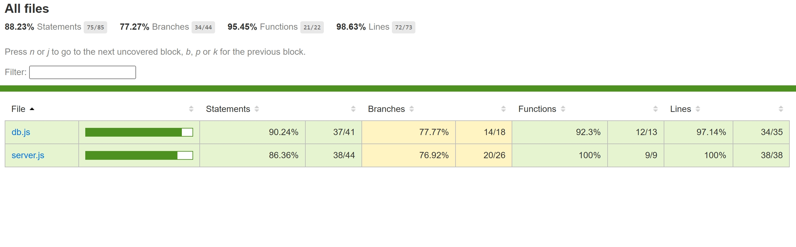

# Shop Inventory API

This is a simple product inventory API. You can use it to add, view, update, and delete items in a simulated store inventory system.

---

## Features/tech stack

- RESTful API using Express.js
- Local SQLite database (`shop.db`)
- Automatically creates products table if empty
- Basic CRUD operations
Testing:
- Jest testing framework
- Supertest for API endpoint testing

### Test Coverage: 


---

## API Endpoints

| Method | Endpoint         | Description                        |
|--------|------------------|------------------------------------|
| GET    | `/products`      | Fetch all products                 |
| POST   | `/products`      | Add a new product                  |
| PUT    | `/products/:id`  | Update an existing product by ID   |
| DELETE | `/products/:id`  | Delete a product by ID             |

---

## Database --> contains the shop inventory

- Uses [SQLite](https://www.sqlite.org/index.html)
- Local `.db` file: `shop.db`
- Product table schema:
  ```sql
  CREATE TABLE IF NOT EXISTS products (
    id INTEGER PRIMARY KEY AUTOINCREMENT,
    name TEXT NOT NULL,
    price REAL NOT NULL,
    quantity INTEGER NOT NULL,
    category TEXT
  );
  ```

---

## How to run 

### 1. Install Dependencies
```bash
npm install
```

### 2. Start the Server
```bash
node server.js
```

Visit [http://localhost:3000/products](http://localhost:3000/products)


### 3. Run Tests
```bash
npm test -- --coverage
```
---

## Sample API Interactions (how to use)

### Add Product
**POST** `/products`  
```json
{
  "name": "Laptop Stand",
  "price": 29.99,
  "quantity": 20,
  "category": "Accessories"
}
```

### Get Products
**GET** `/products`  
Returns an array of all product objects.

### Update Product
**PUT** `/products/1`  
```json
{
  "name": "Metal Laptop Stand",
  "price": 32.99,
  "quantity": 18,
  "category": "Accessories"
}
```

### Delete Product
**DELETE** `/products/1`  
Deletes product with ID 1.

---

## Testing

Example with curl:
```bash
curl http://localhost:3000/products
```

### Keploy Test Report Screenshots


